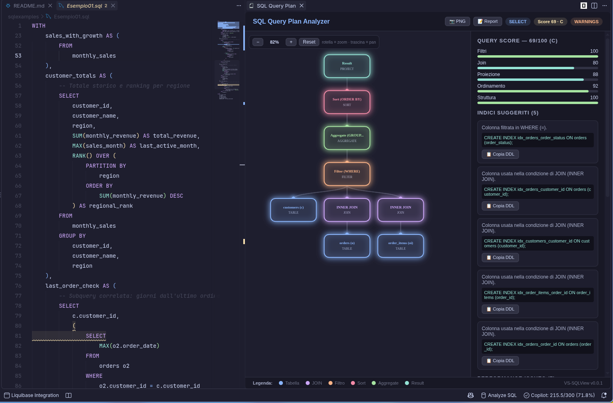
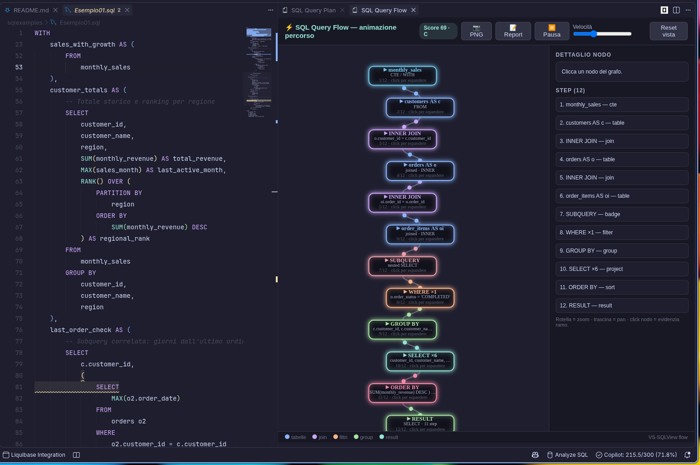

# VS-SQLView


VS Code extension for SQL script analysis and query plan visualization.

Open a `.sql` file, run the analysis, and get a performance score, actionable warnings, index DDL suggestions, and animated visualizations of how your query executes.

### Query Plan Analyzer



### Query Flow


## Demo

<video src="images/vs-sqlview.mp4" controls width="100%">
  Your browser does not support embedded video.
  <a href="images/vs-sqlview.mp4">Watch the demo video (MP4)</a>
</video>

> If the player above doesn't render on GitHub, [watch the demo video directly](images/vs-sqlview.mp4).

## Features

- **SQL performance analyzer with 0–100 score + categories** — each analysis returns a `total` score out of 100 with a grade (`A/B/C/D/F`) plus per-category scores (`Filtri`, `Join`, `Proiezione`, `Ordinamento`, `Struttura`). Detects `SELECT *`, missing `WHERE`/`LIMIT`, `LIKE` with leading wildcard, `OR` conditions, functions on `WHERE` columns, subqueries and scalar subqueries, `DISTINCT`, `ORDER BY` without `LIMIT`, many joins, `CROSS JOIN` / cartesian products, `NOT IN` NULL hazard, `HAVING` without `GROUP BY`, `UPDATE`/`DELETE` without `WHERE`, plain `UNION`, and `INSERT` without a column list.
- **Index DDL suggestions** — generates ready-to-copy `CREATE INDEX ...` statements (up to 6) for `WHERE` filters, `JOIN` keys, `ORDER BY` / `GROUP BY` columns, prefix `LIKE` patterns, and composite indexes for `AND` equality conditions.
- **Animated query-plan tree** — the `Analyze SQL Script` view renders a canvas tree (`Result → Limit → Sort → Aggregate → Filter → Join/Table`) with animated data-flow particles, a score/category sidebar, issue cards, and index cards with a copy-DDL button.
- **Animated vertical query-flow graph with expandable nodes** — the `Show SQL Query Flow` view renders the execution as a vertical step pipeline (CTEs → tables → joins → subquery/UNION badges → WHERE → GROUP BY → HAVING → SELECT → ORDER BY → LIMIT → RESULT) with animated dots, click-to-expand nodes showing full details, zoom (wheel), pan (drag), play/pause, and speed control.
- **Inline diagnostics with quick info & Quick Fixes** — SQL files get squiggles as you type (critical → error, warning → warning, info → info), each annotated with message + suggestion and a `vs-sqlview` source/code. Debounced via `diagnostics.delayMs` and toggleable via `diagnostics.enabled`.
- **Code Actions & Quick Fixes (Ctrl+. / Cmd+.)** — One-click fixes directly in the editor:
  - Replace `SELECT *` with schema-defined columns or explicit column placeholders
  - Add missing row limits tailored to your DBMS dialect:
    - `LIMIT 1000` (PostgreSQL, MySQL, SQLite, MariaDB)
    - `FETCH FIRST 1000 ROWS ONLY` (ANSI SQL:2008, Oracle, DB2)
    - `SELECT TOP 1000 ...` (Microsoft SQL Server / T-SQL)
  - Remove leading `%` wildcards in `LIKE` queries to restore B-tree index compatibility
  - Convert `UNION` to `UNION ALL` for zero-overhead concatenation
  - Replace orphan `HAVING` with `WHERE` or insert `GROUP BY`
  - Remove redundant `DISTINCT`
  - Convert comma joins to `INNER JOIN ... ON ...`
  - Add safety `WHERE` filters to `UPDATE`/`DELETE`
  - Insert or copy suggested `CREATE INDEX` DDL
  - Format SQL selection with one click
- **SQL formatter with Shift+Alt+F** — a `DocumentFormattingEditProvider` for `sql` normalizes keyword case and clause layout (`SELECT`, `FROM`, `WHERE`, `GROUP BY`, `HAVING`, `ORDER BY`, `JOIN ... ON`, `CASE/WHEN/THEN/ELSE/END`, `UNION`, `LIMIT/OFFSET`, etc.). Trigger it with `Shift+Alt+F` (Format Document) or the `Format SQL Document` title-bar button/command.
- **PNG / Markdown export** — both the plan and flow webviews have `PNG` and `Report` buttons: PNG exports the canvas via save dialog, Markdown exports a full report (query, score table, issues table, index DDL blocks) built by `src/report.ts`.
- **Multi-statement QuickPick** — if the active file contains more than one `SELECT`/`INSERT`/`UPDATE`/`DELETE`/`MERGE`/`WITH` statement (split on `;` respecting strings, comments, and parentheses), a QuickPick lets you choose which statement to analyze or visualize.
- **Schema-aware validation via CREATE TABLE / DDL file** — `CREATE TABLE` definitions found in the current document (or in an external file pointed to by `vs-sqlview.schemaFile`) are parsed for table/column names; unknown tables and columns are reported as warnings.

## Requirements

- Visual Studio Code `^1.51.0`
- Node.js + npm (for building from source)
- Language mode `sql` for the active editor (title-bar buttons appear only for SQL files)

## Installation

### Install from VSIX

```bash
npm install
npm run package
```

This produces a `.vsix` file (via `npx @vscode/vsce package`). In VS Code:

1. Open the Command Palette (`Ctrl+Shift+P` / `Cmd+Shift+P`).
2. Run `Extensions: Install from VSIX...`.
3. Select the generated `.vsix` file.
4. Reload VS Code if prompted.

### Dev mode (F5)

1. Open the `vs-sqlview` folder in VS Code.
2. Run unit tests: `npm run test:unit`
3. Press `F5` to launch the Extension Development Host.
4. Open a `.sql` file in the new window and use the title-bar buttons or commands.

## Usage

### Editor title-bar buttons (SQL files)

When a SQL file is active, three buttons appear in the editor title bar (`navigation` group):

| Button | Command |
|---|---|
| Database icon | `Analyze SQL Script` (`vs-sqlview.analyzeSqlScript`) — parses the query, runs the full analysis, opens the query-plan panel, and shows a summary notification with type, score/grade, issue counts, and suggested-index count |
| Zap icon | `Show SQL Query Flow` (`vs-sqlview.showQueryFlow`) — opens the animated vertical flow graph |
| Paintcan icon | `Format SQL Document` (`vs-sqlview.formatSql`) — runs `editor.action.formatDocument` on the SQL file |

### Command Palette

Press `Ctrl+Shift+P` / `Cmd+Shift+P` and run:

- `Analyze SQL Script`
- `Show SQL Query Flow`
- `Format SQL Document`

### Status bar

A `$(database) Analyze SQL` item on the right side of the status bar runs `Analyze SQL Script` on the current file.

### Schema file workflow

1. Create a DDL file with your `CREATE TABLE` statements, e.g. `schema.sql`.
2. Set `vs-sqlview.schemaFile` to its absolute path or workspace-relative path.
3. Run the analysis — unknown tables/columns are validated against the combined (document + file) schema.

## Extension Settings

| Setting | Type | Default | Description |
|---|---|---|---|
| `vs-sqlview.diagnostics.enabled` | boolean | `true` | Show inline performance diagnostics in SQL editors. |
| `vs-sqlview.diagnostics.delayMs` | number (0–5000) | `400` | Delay in ms after typing before the document is re-analyzed. |
| `vs-sqlview.format.keywordCase` | `upper` \| `lower` \| `preserve` | `upper` | Keyword casing applied by the SQL formatter. |
| `vs-sqlview.format.indentWidth` | number (1–8) | `2` | Indentation width (spaces) applied by the SQL formatter. |
| `vs-sqlview.schemaFile` | string | `""` | Path (absolute or workspace-relative) to a `.sql` file with `CREATE TABLE` statements used to validate tables and columns. |

## Example

```sql
CREATE TABLE orders (
  id INT,
  customer_id INT,
  total DECIMAL(10, 2),
  created_at DATE
);

SELECT * FROM orders o
JOIN customers c ON o.customer_id = c.id
WHERE o.total > 100
ORDER BY o.created_at;
```

Run **Analyze SQL Script** on the `SELECT` above and you will get, for example:

- A score such as `Score 74/100 (C)` with per-category bars.
- Warnings like `SELECT *`, missing `LIMIT`, and `ORDER BY` without `LIMIT`.
- An index suggestion such as `CREATE INDEX idx_orders_total ON orders (total);`.
- The animated plan tree and, via the second button, the animated vertical flow (`FROM → JOIN → WHERE → SELECT → ORDER BY → RESULT`).

## Project Structure

- `src/extension.ts` — activation, command registration (analyze/flow/format), status bar, diagnostics wiring, formatting provider.
- `src/sqlParser.ts` — SQL parser (query type, tables/joins, columns, WHERE/GROUP BY/HAVING/ORDER BY, CTEs, subqueries, LIMIT/OFFSET) and multi-statement splitter.
- `src/performanceAnalyzer.ts` — rule checks, 0–100 scoring with grades/categories, and `CREATE INDEX` suggestions.
- `src/queryPlanPanel.ts` — `SQL Query Plan` webview: animated canvas tree + score/issues/indexes sidebar + PNG/Markdown export.
- `src/queryFlowPanel.ts` — `SQL Query Flow` webview: animated vertical step graph with expandable nodes, zoom/pan/playback + PNG/Markdown export.
- `src/diagnostics.ts` — inline `DiagnosticCollection` for SQL files, debounced updates, keyword-anchored ranges.
- `src/sqlFormatter.ts` — tokenizer-based SQL formatter honoring `keywordCase` and `indentWidth`.
- `src/schema.ts` — `CREATE TABLE` DDL parser (`parseSchema`) used for schema-aware validation.
- `src/report.ts` — Markdown report builder (query, score table, issues table, index DDL) used by both export buttons.

## Development

```bash
npm install
npm run compile
npm run package
```

- `npm run compile` — type-checks/builds with `tsc -p ./` (output in `out/`).
- `npm run watch` — incremental build.
- `npm run lint` — `eslint src --ext ts`.
- `npm run package` — builds a `.vsix` via `npx @vscode/vsce package`.

## Contributing

Contributions are welcome! Please open an issue or submit a pull request.

## License

A `LICENSE` file has yet to be added to this repository.
